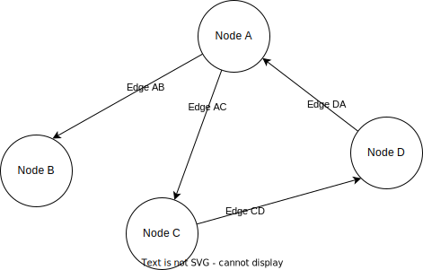
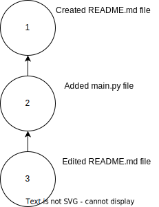

# Understanding Git's graph structure

In the last section, we may have made Git seem a little bit magical. But it's not magical, it's just clever.

In this section we'll be talking about the different concepts and data-structures that allow Git to do what it does. 

## First, you need to know about graphs

The first thing you will need to know about are graphs. The word "graph" can mean different things to different people. In this context, a graph is a network of connected points.  Each point is called a "node", and the lines between them are called "edges". 

Here is an example: 

You can think of all sorts of different things as graphs: 

- The internet is a graph: There are many web pages (nodes) that link to each other (edges)
- The file system on your computer is a graph: The files and folders are nodes, and the edges tell you what is inside any folder/directory.
- Your family is a graph: Each node is a person, and the edges are the relationships between the people

Some graphs are directed and some are undirected. If you were to draw the relationships in your family tree then you could use arrows to make sure that all the parent/child relationships are shown in the same way. 

## Video 

[Here](https://www.youtube.com/watch?v=IjfSA3kMQP0) is a video explaining how graphs work. This video explains a few different types of graphs, and has some examples not in the text.

## Back to Git 

To understand how Git works, it’s helpful to think of your project history as a graph — a network of connected points. 

In this case "project" means collection of files and folders with a purpose. For example you might have a personal blog, in that case you could have a directory called "blog" that contains everything related to your blog project. 

As you work on a project, you'll make changes to different files and folders. And you can keep track of those changes over time. 

As an example, you might make a new project and then add a `README.md` file. Then you could add another file, `main.py`. Then you could make a change to the `README`. 

We can draw this out like so: 

In Git terminology, each of the nodes on the  graph represents a commit, and the connections between them represent how those commits are related. This graph structure is what makes Git so powerful.

## What Are Commits?

A commit is a data structure. It is like a snapshot of your project at a specific moment in time.

Every commit is unique and contains:

- How the files changed since the last commit (if there was a last commit, otherwise it stores the initial files)
- Metadata (like the author, date, time, and a message describing the change).
- A reference to its parent commit(s) (except for the very first commit, which has no parent).

To be clear, a commit does not contain complete information about every single file and folder. It only stores information about what has changed since the last commit.  It will store information about what files were created and where, and specifically what changed in those files.

You can think of commits as steps in a recipe. 

You can recreate the state of a project at any point in time by starting with an empty directory and then exactly following the steps described by the commits. 

You'll see this illustrated in a more practical way later on.

## How Commits Form a Graph

Each commit in Git points back to its parent commit, forming a directed acyclic graph (DAG). This is a fancy way of saying:

- Each commit knows where it came from. It knows what the last commit was before it was created
- The graph has no cycles — meaning commits don’t loop back to earlier ones.

Take a closer look at our commit graph from earlier:

 
Notice the direction of the arrows in the picture. Each commit "knows" about the "parent" commit. 

This chain of commits allows Git to recreate any version of your project simply by following the path back through the graph.

So if you wanted to see what your original `README` file looked like before your most recent changes, you would be able to recreate it based on your initial commit. Git is able to figure out exactly what your whole project looked like when any commit was made.

This is done with the `checkout` command. We'll see this in action later.

If you think of each commit as a snapshot of the entire code base at a point in time then you can use the `checkout` command to load that snapshot. It's a bit like time travel.

## Video 

You can see the git commit graph explained in a video [here](https://www.youtube.com/watch?v=d1qovsLTUcY)

## Version control for the win!

Given what we have covered so far, Git already seems very powerful.

Git allows you to:

- create commits whenever you need to. Commits act like snapshots of your project at different points in time
- checkout a commit to get your project to look like it did when the commit was made. 

Think back to the [last chapter](01-what-is-git-for.md), can you see how this is helpful? 

Stop and think about how this is useful before you read the answer.

If you can create and checkout commits then you no longer need to rely on keeping track of your work by saving different versions of your files manually. 

And if you end up writing bad code that you are struggling to undo, you can use git to load the last working version of your code!

## That's enough theory for now

There is still a lot to be said about the graph structure and what it allows. We still need to show you how Git allows collaboration between team members. 

But before we go deeper into the theory, we'll start doing some practical work.

