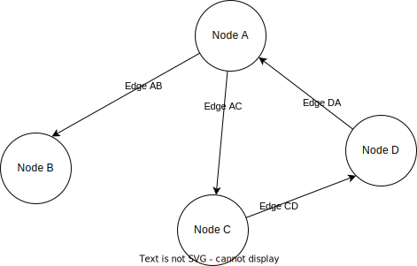

# Understanding Git's graph structure

In the last section, we may have made Git seem a little bit magical. In this section we'll be talking about the different concepts and data-structures that allow Git to do what it does. 

## First, what is a graph?

The first thing you will need to know about are graphs. The word "graph" can mean different things to different people. For programmers, a graph is a network of connected points.  Each point is called a "node", and the lines between them are called "edges". 

Here is an example: 

You can think of all sorts of different things as graphs. 

- The internet is a graph: There are many web pages (nodes) that link to each other (edges)
- The file system on your computer is a graph: The files and folders are nodes, and the edges tell you where everything is in relation to each other (ie: what is inside any folder)
- Your family is a graph: Each node is a person, and the edges are the relationships between the people 

Take a moment to make sure you understand this concept. If you were asked to draw a graph of your family tree, would you know what to do? Ask questions if you need to!

Some graphs are directed and some are undirected. If you were to draw the relationships in your family tree then you could use arrows to make sure that all the parent/child relationships are shown in the same way.  

## Back to Git 

To understand how Git works, it’s helpful to think of your project history as a graph—a network of connected points. Each point represents a commit, and the connections between them represent how those commits are related. This graph structure is what makes Git so powerful, allowing you to track changes, rewind to earlier versions, and manage branches seamlessly.

## What Are Commits?

A commit is like a snapshot of your project at a specific moment in time. Every commit is unique and contains:

- How the files changed since the last commit (if there was a last commit, otherwise it stores the initial files)
- Metadata (like the author, date, and a message describing the change).
- A reference to its parent commit(s) (except for the very first commit, which has no parent).

## How Commits Form a Graph

Each commit in Git points back to its parent commit, forming a directed acyclic graph (DAG). This is a fancy way of saying:

- Each commit knows where it came from.
- The graph has no cycles—meaning commits don’t loop back to earlier ones.

As an example, you might make a new project and then add a `README.md` file and create a commit. Then you could add another file, `main.py` and create another commit. Then you could make a change to the `README` and commit that. 

We can draw a picture of our commits like this:

TODO.

This chain of commits allows Git to recreate any version of your project simply by following the path back through the graph.

So if you wanted to see what your original README file looked like before your most recent changes, you would be able to go and look at your initial commit. Git would be able to figure out exactly what your whole project looked like.

## Check your understanding 

Considering the 3 commits we just spoke about, can you answer the following questions for yourself:

- does the first commit have a parent? 
- does the second commit have a parent? 
- does the third commit have a parent? 

## Adding Branches: Making the Graph Dynamic

So far our graph looks pretty boring, there are 3 nodes in a straight-line. Things get interesting (and very useful)when we introduce branches. 

The first thing to understand is that multiple commits can have the same parent. So you could create a graph that looks like this:

TODO 

In Git, branches are pointers to specific commits. They let you work on different parts of your project simultaneously. When you create a new branch, Git doesn’t duplicate files. Instead, it simply creates another pointer to the same commit.

This last point is very important so I'll say it again in a different way:

You might think that a "branch" is a whole series of commits. This is incorrect! A branch is just a label that refers to a specific commit. When you create a new branch, then you just create a new label.

TODO

The main branch points to commit C.
The feature branch points to commit E.
Both branches share the history up to B. From there, they diverge. This branching structure allows you to experiment in feature without affecting main.

Merging Branches: Connecting the Graph
When you finish working on a branch, you can merge it back into another branch. This creates a new commit that has multiple parents, representing the union of both branches.

Example:

css
Copy code
    A → B → C (main)
           \   \
            D → E → F (merge)
Commit F is the merge commit. It has two parents: C from main and E from feature.
Git’s graph structure ensures the history remains intact, so you can always trace where changes came from.

Rebasing: Rewriting the Graph
Rebasing is a way to "replay" commits from one branch onto another, effectively rewriting the graph. Instead of creating a merge commit, it creates a straight line of commits.

Before rebasing:

css
Copy code
    A → B → C (main)
           \
            D → E (feature)
After rebasing feature onto main:

mathematica
Copy code
    A → B → C → D' → E' (feature)
Now, D' and E' are new commits that appear to be based on C. Rebasing simplifies the graph but should be used with caution because it rewrites history.

HEAD: Navigating the Graph
The HEAD in Git is a pointer that tells you where you currently are in the graph. When you switch branches or check out a specific commit, HEAD moves to that point.

If HEAD points to a branch, you’re working on that branch.
If HEAD points directly to a commit, you’re in a "detached HEAD" state.
Why Git’s Graph Structure Matters
Efficient Storage: Instead of saving every file in every commit, Git tracks changes (or deltas). The graph ensures these changes are applied in the right order.

Flexibility: The graph lets you branch, merge, and rewind with confidence. No matter how tangled your project history becomes, the graph keeps everything organized.

Traceability: Every commit in the graph is traceable. You can find out who made a change, when, and why.

Collaboration: The graph makes it easy for teams to work on different parts of a project without overwriting each other’s work.

Visualizing the Git Graph
You can see your project’s graph structure using the git log command with options like:

bash
Copy code
git log --oneline --graph --all
This will produce an ASCII visualization of your commit history, showing branches, merges, and the flow of your project’s evolution.

Git’s graph structure isn’t just a technical detail—it’s the foundation of everything that makes Git powerful. Once you understand it, you’ll see why Git is the tool of choice for developers worldwide.