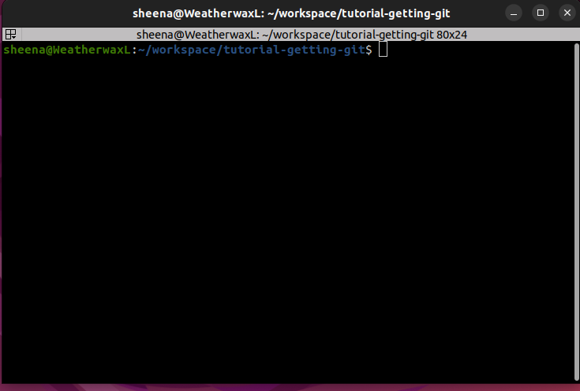
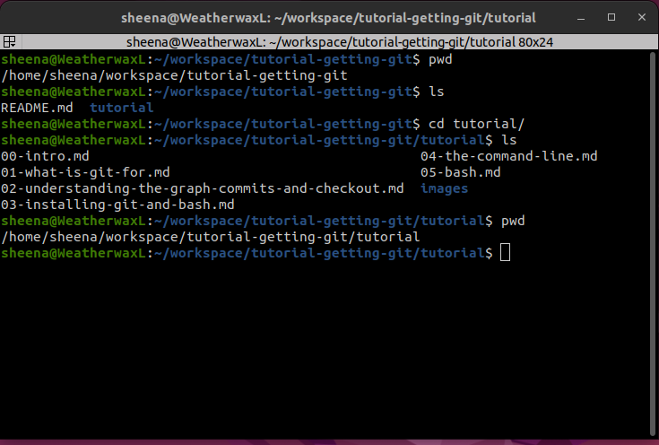
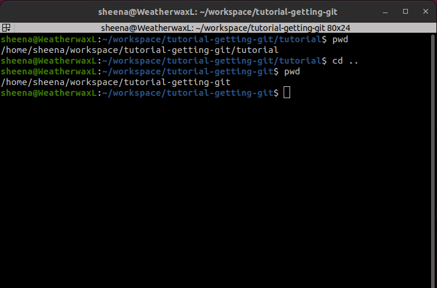

# Bash and the Terminal

Before we start learning about Git commands, we'll need to cover a little bit of Bash. 

Bash, short for "Bourne Again SHell," is a program that helps you interact with your computer by typing commands instead of clicking on things. It’s like having a conversation with your computer, but instead of using a mouse and buttons, you use your keyboard to type instructions.

Think of Bash as 

1. Your Computer's Command Listener: You type commands, and Bash makes sure the computer understands and executes them.
2. A Command Line Interface (CLI): Bash runs in a terminal, which is a window where you can enter and run text-based commands.

## Why Learn Bash?

- **Powerful Control**: You can perform tasks like moving files, installing programs, or automating repetitive work faster than you could with a mouse.
- **Widely Used**: It works on most Linux and macOS systems, and many programming tasks rely on Bash.
- **Scripting**: With Bash, you can write scripts—small programs that perform a series of commands automatically.

## What Does Bash Look Like?

When you open a terminal, you'll often see something like this:



Note that it is likely to look different on different computers - if you are running Linux and your friend is running Windows, then your terminals will look different. But bash works the same way.

This is the command prompt, where Bash waits for your instructions. You type commands here, and when you press Enter, Bash will execute them.

## Understanding Bash 

Bash is a very big topic, it's a whole language! We wont cover all of it, just the basics that you will need to know for understanding Git.

### Entering commands 

If you want to give Bash a command, then you type it in and press Enter. That's it. 

Try this command: `date`.

Can you get it to execute? What did it do? 

### Current working directory

If you were to open up a graphical file browser then you would be able to click buttons to navigate to different directories and see what files are inside those directories. You would also be able to interact with those files and directories.

Bash is similar. 

The current working directory is the folder Bash is "focused on". It’s like the place where Bash is "standing" and looking for files or running commands.

When you open a terminal, Bash starts in a specific folder (usually your home directory), and this folder is your current working directory until you move to another one.

### Commands for navigating 

Here are a few commands you'll need to be familiar with as we learn Git:

- `pwd`: This tells you what directory you are currently in
- `ls`: This lists the contents of the current directory 
- `cd`: This one is for changing the directory to a different one. This command is special - when you call this command then you need to tell Bash which directory you need to change to. 

### The `cd` command structure

If you want to tell Bash to change to a directory, then you need to use an argument to change to the right directory. 

The way you do this is by providing an argument to the `cd` command. The command would look something like:

```
cd the_path_of_the_directory_you_want_to_navigate_to
```

Here is an example:



In this image, I started off by using the `pwd` command do see what my working directory was. Then I used `ls` to see what was inside the directory. 

I then used `cd` to navigate to the `tutorial` directory.

When I executed the `ls` and `pwd` commands again, then it was clear that I was in a different directory.

In this case the `tutorial` directory was a child of my current working directory. 

I can also navigate to a parent directory like so:



## Play with it a bit! 

It's very important that you are comfortable with the concepts in this section! They will come up again and again in different circumstances in your coding career.

Open up a terminal and play with the commands. Are you able to navigate around your computer?

## The directory structure is a graph

Remember we were talking about graphs earlier? Well, the directory structure is a special kind of graph called a "tree". Each node on the graph represents either a file or a folder, and the lines between the nodes are the parent/child relationships between the nodes.

There is one more critical concept you need to know about at this point: You need to know what the "root" directory means.

Lets say you are working on a project for your own personal website. So you make a directory called "website". Inside that directory, you create a few files and folders for holding different things. 

Let's say your directory structure ends up looking like this:

```
website   <<< This is the root directory
├── static
│   ├── css
│   │   └── main.css
│   └── javascript
│       ├── something.js
│       └── somethingElse.js
├── portfolio.html
└── index.html
```

Your project's "root" directory is "website" because it contains everything else. 

Also, your whole computer's file-system has a root directory. 

## Relative paths

We have used the `cd` command to move from one directory to another. But so far we can only move from parent directories to children, or vice versa.

This can be a bit slow - if you want to navigate to a folder that is far away on the graph then you might end up writing a lot of `cd` commands. There is a faster way to do things:

Let's consider this directory structure again:

```
website 
├── static
│   ├── css
│   │   └── main.css
│   └── javascript
│       ├── something.js
│       └── somethingElse.js
├── portfolio.html
└── index.html
```

Let's say we are in the root directory and we want to navigate to the `javascript` directory. We could do it like this:

```
cd static/javascript
```

This is the same as saying:

```
cd static
cd javascript
```

Now, let's say we are in the `javascript` directory and we want to navigate to the `css` directory:

```
cd ../css
```

This is the same as saying:

```
cd ..
cd css
```

## Absolute paths

Up until now, we have been making use of "relative" paths when telling `cd` where to go:  

For example, `cd ../css` can be read as: starting from our current directory, move to the parent directory, then to the `css` directory. And `cd static/javascript` can be read as: starting from our current directory, move to the `static` directory then to the `javascript` directory.

All the paths were *relative* to our current working directory.

Absolute paths, on the other hand, are relative to the root of your file system. For example:

```
cd /home/sheena/workspace/personal_website
```

The forward slash `/` at the start of the path tells bash that we are talking about the computer's root directory. The rest of the path is relative to that. 

This command can be re-written as:

```
cd /                  # absolute path
cd home               # relative
cd sheena             # relative
cd workspace          # relative
cd personal_website   # relative
```

Comparing Absolute and Relative Paths

| Feature |	Absolute Path |	Relative Path |
|  ----- |  ----- |  ----- | 
| Starts From | 	Root directory (/)	|  Current working directory | 
| Flexibility | 	Works from anywhere	|  Depends on your current location | 
| Example Command	| cd /home/username/projects	|  cd projects (if already in /home/username) | 

## Home directory

Another thing you will hear about from time to time is the `home` directory.

You can `cd` into your home directory by doing either of the following:

```
cd 

cd ~
```

In other words, if you type in `cd` and press enter without giving it any path to go to, then it will go to your home directory. 

You can also use the `~` (tilde) character to go to your home directory. You can see how to pronounce tilde [here](https://www.google.com/search?q=tilde+pronunciation).

Try this:

- `cd` into any directory on your computer. Just navigate somewhere
- type in `pwd` to see where you are 
- then use `cd` or `cd ~` to go back to your home directory 
- use `pwd` again

Now you know where your home directory is.

## Paths relative to home

The ~ character allows you to quickly type in paths that are relative to your home directory. 

For example, you can say:

```
cd ~/Documents
```

## More bash commands 

Here are a few more things you will find useful:

```
# This is a comment

# To make a directory, use the mkdir command

mkdir /path/to/directory 

# NOTE: /path/to/directory is a placeholder! You should use a path that makes sense for you! 

# To remove a file or directory, use rm:

rm /path/to/file/or/directory

# To get help on any command, use the --help option. 
# This will tell you what options and arguments to use
# Eg:

ls --help 

# You can also get access to the system reference manual for any command using the man command.
# Eg:

man rm

# To print out the contents of a file, use the cat command:
# Eg:

cat /path/to/file

# To create a new empty file, use the touch command:
# Eg:

touch /path/to/file

```

## Optional Side Quest: Oh My Zsh 

If you want an extra challenge, you can customise your Bash experience. There are many ways to do this. One popular option is to make use of zsh and [Oh-My-Zsh](https://ohmyz.sh/)

Note: This works best on Linux and Mac. If you are running Windows, then it's best to install it using Windows Subsystem for Linux.