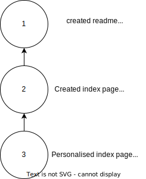
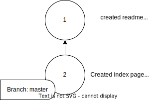

# A bit more about the git graph structure 

[Earlier](./02-understanding-the-graph-commits-and-checkout.md), we spoke about the Git graph structure. If we were to draw our 3 commits from the [last section](./06-first-repo.md) then they would look like this:



Now, there are 2 new concepts to introduce. These will help you make more sense of some of the `git status` messages.

In this section we'll introduce the concept of a branch and the `HEAD`. 

## What is a branch?

A branch is a data structure that contains:

- a name
- a pointer to a commit 

You can think of it like a bookmark. 

When you initialise a new Git repo then a new branch is created. It's name is `master` by default.

As you created your commits, your `master` branch got updated to point to the latest commit.

When we created the first commit, the graph would have looked like this:


Then when the second commit was created, the graph would have looked like this:



Then when we created the third commit:


For now, that's all you need to know about branches. We'll go into detail about how to make branches and what you can use them for a bit later. 

## What is the `HEAD`?

In Git, `HEAD` is also like a bookmark. It points to where you currently are in your project’s history. It keeps track of which commit (snapshot of your project) or branch you are currently working on.

Here’s how it works:

When you’re on a branch: HEAD points to the branch, which in turn points to the latest commit on that branch. For example, if you're working on the master branch, `HEAD` points to master.


When you check out a specific commit: `HEAD` detaches and directly points to that commit instead of a branch. This is called being in a "detached HEAD" state. The `HEAD` is detached if it is pointing directly to a commit instead of to a `branch`. 

Think of `HEAD` as your current position in the Git timeline. It tells Git, “This is the point in the project’s history I’m working on right now.” It's almost like your current working directory in a terminal but, instead of pointing to a location in a directory structure, the `HEAD` points to a version of your repo.

## Remember `git status`?

In the last section, you used `git status` a lot. I hope you read the output carefully! 

Git status told us different things under different circumstances. Here are a few of the messages it gave us over time. 

See if you can understand what they mean now that you know what `master` and `HEAD` mean:

```
On branch master
nothing to commit, working tree clean
```

```
On branch master
Changes not staged for commit:
  (use "git add <file>..." to update what will be committed)
  (use "git restore <file>..." to discard changes in working directory)
        modified:   index.html

no changes added to commit (use "git add" and/or "git commit -a")
```

```
HEAD detached at 972e328
nothing to commit, working tree clean
```

If you are not sure what these mean, play around with your local repo a bit - edit files, create commits, use the log and checkout different versions of your code. Try to get an idea of when the different messages come up.

## Video 

[Here](https://www.youtube.com/watch?v=XmZ41lr2PVg) is a video that explains the concepts above.

And [here](https://www.youtube.com/watch?v=L8Mhq0CXGLE) is a video that only focuses on the detached HEAD state.

## Practice and Play 

Make sure you make the time to explore these concepts. Try making some changes to some of the files in your repo, make some commits, `checkout` different things. 

- Do you know how to detach the HEAD?
- Do you know where the `master` branch will be if you make a commit? What if you are in a `detached HEAD` state?
