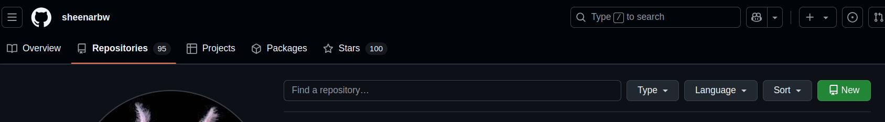
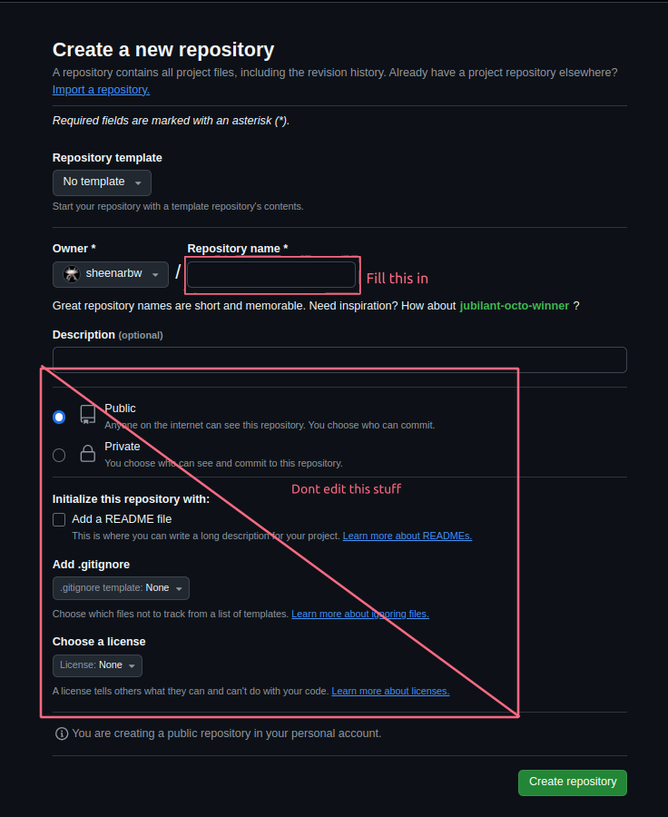
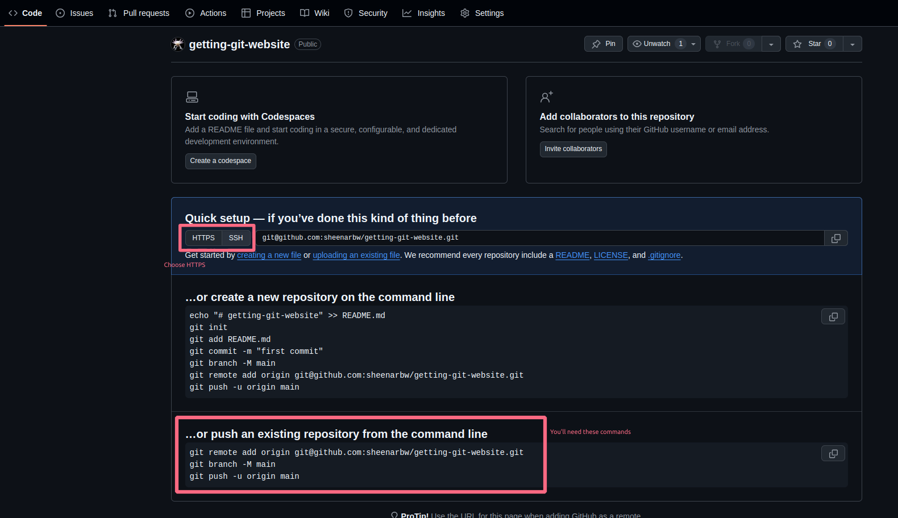
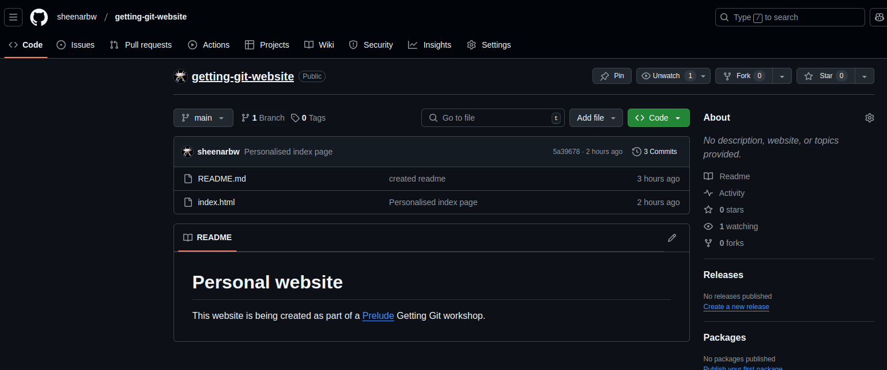
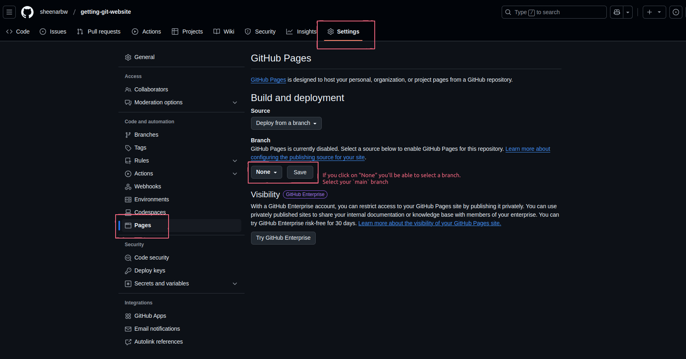
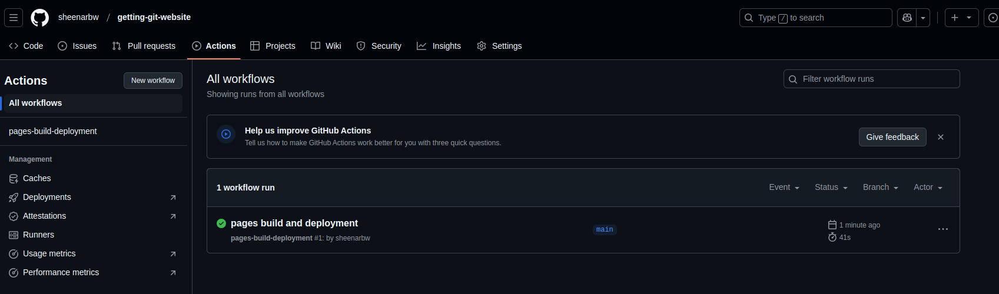
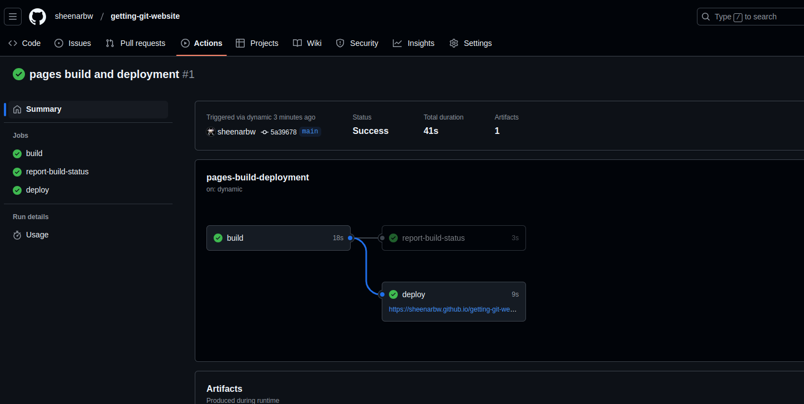

# Introduction to Github 

So far, we've seen how you can use Git on your local computer so that you can:

- keep track of changes to your project over time
- use commit messages to describe different versions of your project
- switch to different versions of your project by using the `checkout` command
- see what changes were made at different points in time.

This is powerful already! But Git can do a whole lot more!

## Remote backup 

The next thing we are going to cover is: How to keep a backup of your work online. Backing your stuff up is useful for a few reasons:

1. If your work is online, your team-mates can access it
2. If you have multiple copies of your work then if your computer crashes you'll be alright 
3. You can access your own work from different places. You wont always need your computer with you in order to work 

We'll be setting up our personal_website repo so that we can back it up to a service called Github. 

## What is Github?

Here is a quote from [Wikipedia](https://en.wikipedia.org/wiki/GitHub):

> GitHub is a proprietary developer platform that allows developers to create, store, manage, and share their code. It uses Git to provide distributed version control and GitHub itself provides access control, bug tracking, software feature requests, task management, continuous integration, and wikis for every project. Headquartered in California, it has been a subsidiary of Microsoft since 2018.
> 
> It is commonly used to host open source software development projects. As of January 2023, GitHub reported having over 100 million developers and more than 420 million repositories, including at least 28 million public repositories. It is the world's largest source code host as of June 2023. Over five billion developer contributions were made to more than 500 million open source projects in 2024.

So, it's really worth knowing about!

## First, Sign up

Github is free to use. If you haven't signed up yet, do it now:

1. Go to [https://github.com/](https://github.com/)
2. Click on the sign-up button
3. Fill in the form and follow the process

**IMPORTANT**: You will keep your Github account for a long long time, so make sure you are sensible when you sign up:

1. Use a personal email address if you can. If you sign up with a school or work email address then you might not have access to that address in 5 years.
2. Choose a username you will be happy with for a long time. You can use your own name, a social-media handle, or something awesome. You can change it later, but that can be inconvenient for a lot of reasons

## Make a repo on Github

Once you are logged in, go to your profile page. The url will be like this: https://github.com/YOUR_USERNAME_HERE  (please use your own username in the url!) 

Then click on the repositories tab. 

Then click on the green button that says **New**.

 

Now you will see a pretty big form to fill out: 



Fill in a "repository name". This can be "Personal website" or "Getting Git website" or similar.

Leave all the other form fields as they are for now. The default values are good!

Scroll to the bottom of the page and click the "Create repository" button. 

You should now see a page that looks like this:


## Configure your local repo

Now, you'll need to set up your local repo (your your local personal_website repo from the last section) so that it knows about the repo you created on Github. Then you will be able to back your code up and save it to Github.

The Github page you are looking at will have a section with the heading: "Quick setup — if you’ve done this kind of thing before". There will be an "HTTPS" button and an "SSH" button. Select "HTTPS". 

When you click on "HTTPS" you'll see that all the git addresses mentioned in the page get updated. Instead of things saying `git@github.com:YOUR_USERNAME/YOUR_REPO_NAME.git`, you'll see something more like `https://github.com/YOUR_USERNAME/YOUR_REPO_NAME.git`.

Feel free to switch/toggle between the HTTPS and SSH options a few times to see the difference.



Now look lower down in the page. You'll see another heading that says: "…or push an existing repository from the command line". This section is relevant to us because we already have an existing repository.

There will be a few commands written there. The commands will look something like this:

```
git remote add origin https://github.com/YOUR_USERNAME/YOUR_REPO_NAME.git
git branch -M main
git push -u origin main
```

In your local terminal, make sure your `HEAD` is pointing to the master branch. 

You can do this by checking out master: `git checkout master`. You might have already done this but it is good to be sure. 

Then paste in the 3 commands that Github gave you. Paste one in at a time.

When you try to execute the `git push` command, you will be asked to authenticate with your Github username and password. 

Once all the commands have been executed successfully, move forward. But if you get any errors you can't solve, please ask for help!

## Exploring Github

Now, in your web browser, go look at your repo on Github. The url will be something like this: `https://github.com/YOUR-USERNAME/YOUR-REPO-NAME`. If you are already on that page, then refresh the page. 

You should now see something like this:



Time to explore!

Here are a few challenges for you. Try to figure out how to do these by navigating around the Github website. Remember that you can ask for help if you need to :)

- Can you view the code in your `index.html` file?
- Can you see how many commits there have been?
- Can you see the message from the last commit that edited the `README.md` file?
- Is there anything special about the `README.md` file? Is it displayed in a special way?
- If you click on the latest commit message (in the screenshot, it is "Personalised index page") then what happens? Can you make sense of what you see? Can you navigate to the commit's parent?
- Can you navigate to a page that shows a list of all the commits?

## Github Pages: Free website hosting! 

One really cool thing about Github is that it allows you to host simple websites for free!

Navigate to your repo then click on the settings tab. Then, on the left hand side, click on "Pages"



Under "Branch", you will see a dropdown that has the value "None". Change that to "main" and then click "Save".

When you do this then Github sets up an automation for you: whenever you `push` (upload) code to your main branch, then Github will trigger a workflow that will deploy your website. 

You can see the status of the workflow by going to the "Actions" tab:



Here, you will see a workflow that is busy running. You can click on it to see the details. 



Once the workflow has finished running then you will be able to see a url in the `deploy` box. If you click on it then it will take you to your live website! 

Your website url will be something like this `https://YOUR_USERNAME.github.io/YOUR_REPO_NAME/`. 

You can share that URL with whoever you want and they'll be able to see it!

## Make a change to your `index.html` file 

On your local computer, open up your `index.html` file in a text or code editor.

Make a change to the site. You don't need to be fancy, you can just change some of the text.

Here is an example:

```
<!DOCTYPE html>
<html>

<head>
    <title>Sheena's website</title>
</head>

<body>
    <h1>Hi, I am Sheena</h1>
    <p>I like Software development, teaching, and the great outside.</p>
</body>

</html>
```

Commit your changes, and give your commit a nice message. My commit message would be something like: "Added personal preferences to index.html page".

Finally, do a `git push`.

Now you can go and look at your Github Actions again. You'll see that there is a workflow running. Once it is finished running then your latest changes will be live!

Take a look at your website and make sure.

## Optional Side Quest: Github Profile Personalisation

Github allows all sorts of personalisation. You can upload a profile picture, add social media links to your account, and change your profile page so that it says what you want it to say. 

Head over to your profile page, and see what you can edit.

You might find this useful along the way: [Basic writing and formatting syntax](https://docs.github.com/en/get-started/writing-on-github/getting-started-with-writing-and-formatting-on-github/basic-writing-and-formatting-syntax). This will be useful if you want to update the text that shows up on your profile page.

## Optional Side Quest: Configure your SSH key 

Remember earlier on when you were configuring your local Git repo, there was an option to use SSH or HTTPS. You clicked on the HTTPS button.

That was necessary because we had not yet set up a SSH key.

While SSH isn't critical for this tutorial, SSH is helpful and secure. It takes a few steps to set it up, and it might take a bit of effort to understand.

If you use Git and Github professionally, then you are very likely to need to use an SSH key. 

### What is SSH for?

When you execute a `git push` command then your local Git program communicates with Github. It updates the code and the commits that Github stores.

This needs to happen in a secure way - You need to be able to push your code to Github, but if someone random tried to push changes to your website then it shouldn't be allowed.

So Github needs to know who is pushing.

There are two ways to do this: HTTPS or SSH.

We have been using HTTPS up until now. This means that every time we push to Github, we have to supply a username and password. This is repetitive, annoying, and easy to mess up.

SSH allows us to use a different authentication method that is based on cryptographic key files. These are special files that contain very long and complicated strings of characters, you can think of them as special passwords for now.

If you set yourself up so you can use SSH to push, then Git will use these key files automatically. You wont need to supply your username and password each time.

### Setting up your SSH key

We'll need to do a few things to set this up.

1. Create SSH keys on your local computer (you'll create a public and a private key)
2. Upload your SSH public key to Github
3. Update your local repo so that it makes use of SSH instead of HTTPS 

#### 1. Create SSH keys on your local computer

To generate a new SSH key, you can follow [this guide](https://docs.github.com/en/authentication/connecting-to-github-with-ssh/generating-a-new-ssh-key-and-adding-it-to-the-ssh-agent?platform=mac).

Make sure you follow the instructions for the operating system you are running (Mac, Windows or Linux).

#### 2. Upload your SSH public key to Github

Follow [this guide](https://docs.github.com/en/authentication/connecting-to-github-with-ssh/adding-a-new-ssh-key-to-your-github-account#adding-a-new-ssh-key-to-your-account) to add your new SSH key to your Github account.

Test that it is configured correctly by following [this guide](https://docs.github.com/en/authentication/connecting-to-github-with-ssh/testing-your-ssh-connection)

#### 3. Update your local repo so that it makes use of SSH instead of HTTPS 

Execute the following commands for your local Git repo:

```
git remote remove origin
git remote add origin git@github.com:YOUR_USERNAME/YOUR_REPO_NAME.git
```

Now, the next time you `git push`, your local Git will authenticate automatically!