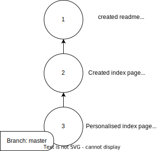

# Understanding multiple branches 

In an [earlier section](./07-graph-branch-and-head.md) we touched on the concept of a branch. Do you remember what a branch is?  

If you don't remember, then go back and check! 

## Visualising multiple branches  

We spoke about making a few commits on a project. We ended up with a graph that looked like this:

So far our graph looks pretty boring, there are 3 nodes (commits) in a straight-line. Things get interesting (and very useful) when we introduce more branches. 

Earlier, we spoke about how every commit (except the first one) has a parent. 

Now, it's important to understand that multiple commits can have the same parent. So you could create a graph that looks like this:

 

Remember how a branch is a pointer to a specific commit? In the diagram above we have 3 branches, each pointing to a different commit. 

We have `main` and then 2 different feature branches: `feature_1` and `feature_2`. In a real project each of these feature branches could "belong" to different people. For example, Alice might be working on an authentication feature, while Bob is working on a user-profile feature.

## Checking out a branch

If you look at the `feature_1` branch in the diagram above, then you will see it points to commit number 7. Commit 7's parent is 6, and 6's parent is 4, etc.  If we were to `git checkout feature_1` then that would point our `HEAD` at `feature_1`, so we would be at commit number 7.  

Remember how each commit keeps track of the changes made since the previous commit? So a sequence of commits is like a recipe that can be followed to create a bunch of files and directories.

Well, if we checkout `feature_1` then that would be like taking an empty directory and then applying the changes from the following commits in order: 1, 2, 4, 6, 7.

In other words, the `feature_1` branch is **NOT** aware of the changes in commits 3, 5, 8 or 9.

Similarly, if you were to `git checkout main` then the files and directories you see would be due to commits 1, 2, 3 and 5. 

## Why is ths useful?

Let’s imagine a team of three developers — Alice, Bob, and Charlie — working on an app for managing recipes.

Alice is tasked with adding a search feature so users can quickly find recipes. Bob is creating a feature that lets users upload photos of their dishes. Meanwhile, Charlie is fixing a bug where the app crashes when a recipe has no ingredients.

Each of the developers can create a new branch for their personal tasks. 

Alice creates a branch called `feature/search`. She can focus on her search feature without worrying about what Bob or Charlie are doing. If her changes break something, it’s contained in her branch. It doesn't effect anyone else's code.

Bob creates a branch called `feature/photo-upload`. He’s free to experiment with file handling and image storage without affecting anyone else’s work.

Charlie creates a branch called `bugfix/empty-ingredient-crash`. He can fix the bug independently, ensuring his updates don’t disrupt Alice or Bob.

In this situation it is clear that branches have some benefits:

1. **Isolation of Changes**: Each branch represents a separate line of development. This means a team member can work on a feature or fix a bug in their own branch without affecting the main project or others' work.

2. **Parallel Development**: Multiple people can work on different branches at the same time. For example, one person can work on a new feature while another fixes a bug.

3. **Reduced Risk**: If something goes wrong in a branch, it won't affect the main project. This makes it safer to experiment or try new things.

4. **Better Organization**: Branches make it easier to keep track of what's being worked on. Each branch can be named after the task or feature, making the workflow more organized and understandable.

Now, let's say Bob is able to complete his feature's code while the other two developers are still working. 

Git and Github have tools that allow the team to review Bob's work and **merge** it into the main branch. His work wont be **merged** into the main branch until the team have agreed that it is good enough. This way, the main branch can be kept clean and working.

## Merging 

In the last section we mentioned the word "merge". Let's take a moment to talk about what that means:

Here are a few things we already know about commits:

- Every commit (except the very first commit) has a parent
- Multiple commits can have the same parent. This comes into play when we start branching

A new thing to know is: A commit can have multiple parents. Like this:

TODO: Pic 

Merging is the act of combining the code changes from multiple branches. If you merge a feature branch into the main branch then that makes a new commit on the main branch.

Let's say you are on the `main` branch, and you have a feature branch like this:

TODO

If you merge the feature branch into main then the graph will end up looking like this:

TODO

This is what happened:

- a new commit was created 
- the main branch was updated to point to the new commit 
- the new commit has 2 parents
- the feature branch remains unchanged 
