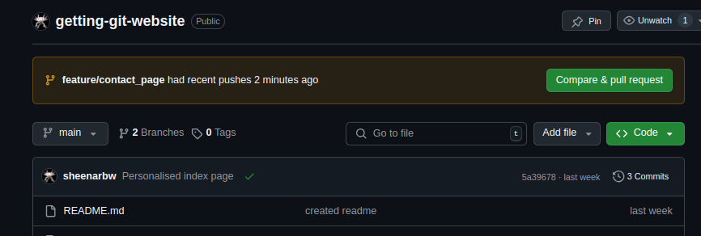
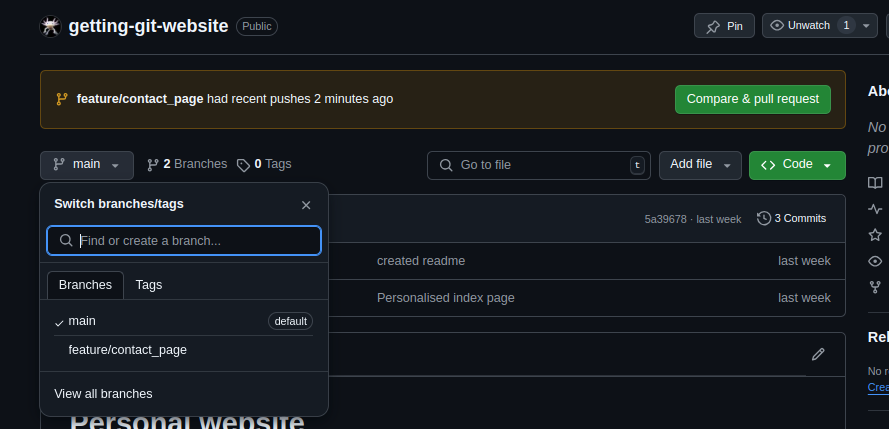
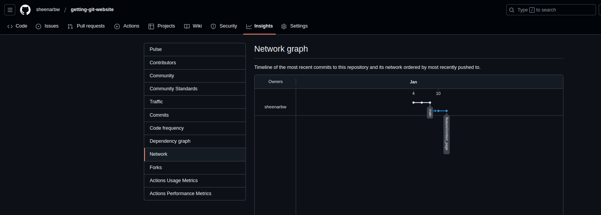

# Practical: Creating and merging branches 

In this section, we'll be making use of Git commands to create and merge branches.

We'll be working with your personal website repository.

## Let's create a branch 

Let's say we want to add a new feature to your website. We'll make a new page for your contact information. 

You can start off by creating a new branch called `feature/contact_page`. Do it like so:

```
git branch feature/contact_page
```

Now type in `git branch` to see what branches you have. The output should look something like this:

```
  feature/contact_page
* main
```

The little `*` next to `main` tells us that you are still on the `main` branch.

If you type in `git log` then your latest commit will look something like this:

```
commit 5a39678344011133ce255be732c56ee2ccf53f90 (HEAD -> main, feature/contact_page)
Author: Sheena <me@email.com>
Date:   Sat Jan 4 09:56:49 2025 +0200

    Personalised index page
```

This tells us that both the branches, `main` and `feature/contact_page` are pointing to the same commit, and that `HEAD` is pointing to `main`.

Now do this: `git checkout feature/contact_page`.

What do you think the output of `git branch` will look like now? And how about `git log`? And `git status`? Think about it, then check if you got it right.

Now, create a new file in your project: `contact.html`.

Write this inside the file:

```
<!DOCTYPE html>
<html>

<head>
    <title>Contact information</title>
</head>

<body>
    <h1>Contact me</h1>
    <p>TODO: Enter contact info here</p>
</body>

</html>
```

Now commit your changes and leave a sensible commit message. 

```
git add . 
git commit -m "added contact page"
```

Take a look at your `git log` again. 

See if you can answer these questions:

- where is the `main` branch? Is it the same as it was before you made the commit? Or is it different?
- where is the `feature/contact_page` branch? Is it the same as it was before you made the commit? Or is it different?

Now try to `git push`. 

You'll see an error. It will say: 

```
fatal: The current branch feature/contact_page has no upstream branch.
To push the current branch and set the remote as upstream, use

    git push --set-upstream origin feature/contact_page
```

Git is nice because it will often give you hints about what commands to use in different situations. 

Use this command to push your code:

```
git push --set-upstream origin feature/contact_page
```

Now make another change to your contact.html file. For example you might want to add your social media handles.

Eg:

```
<!DOCTYPE html>
<html>

<head>
    <title>Contact information</title>
</head>

<body>
    <h1>Contact me</h1>
    <p>Follow me on my socials:</p>

    <ul>
        <li><a href="https://www.linkedin.com/in/sheena-o-connell-0bb72527/">LinkedIn</a></li>
        <li><a href="https://x.com/sheena_oconnell">X: @sheena_oconnell</a></li>
        <li><a href="https://fosstodon.org/@sheena">Mastodon: @sheena@fosstodon.org</a></li>
    </ul>
</body>


</html>
```

And commit and push your changes:

```
git add .
git commit -m "added social media handles"
git push
```

This time, `git push` just worked!

## Explore Github 

In your web browser, navigate to your repo on the Github website.

```
https://github.com/YOUR_USERNAME/YOUR_REPO_NAME
```

Github will show you a message that says your branch was pushed recently.



You will also be able to click on the dropdown menu (currently it says `main`) in order to switch between branches



Do a little exploring:

- Click on the "Compare & Pull request" button. 
- Scroll down. Can you see the new commits?
- Can you see the changes you have made to your contact page?

Go back to your previous page (click the back button). The url should be like `https://github.com/YOUR_USERNAME/YOUR_REPO_NAME` again.

Can you use the dropdown menu to switch between branches? Explore a bit, is everything as you would expect?

Lastly, click on the `Insights` tab and then click on `Network`. This will give you a picture of your git graph. 



Try hover over each of the commits in the graph. What happens?
What happens if you click on one of them?

## Now, back to your computer

Take a look at your `git log` and `git status`. Take note of what you see there. Is it what you expect?

Now checkout your main branch. 

```
git checkout main
```

Check your `git log` and `git status` again. What do you notice? What is the difference? If you are not sure then you can `git checkout feature/contact_page` again to double check. 

You can switch between the branches as many times as you need to!

```
git merge feature/contact_page
git push
```

Go and explore Github again. Is everything as you would expect? Is anything surprising?

## Recap 

You have made one branch and you have merged it. That's a good start! 

In the next section, we'll be dealing with multiple branches.
