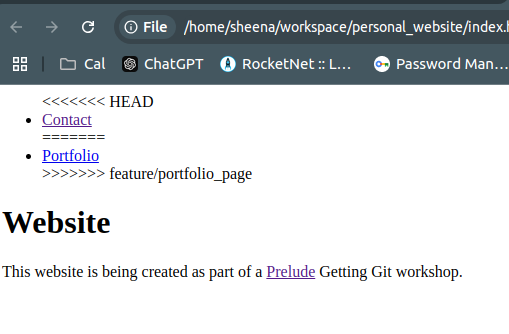

# Creating and merging multiple branches

In this section we will be creating and merging multiple branches. We'll also be dealing with our first ever merge conflict.

## What are we going to do?  

In this section, we'll be creating multiple features on our website. Each of those features will get a branch of its own:

### Feature 1: Add link to contact page to home page

We need to make our site easier to navigate. We should be able to access our "contact" page from our home page. 

### Feature 2: Implement a "portfolio" page

Here we'll be creating a new page for showcasing portfolio projects. We'll add some basic information and then we'll add a link to our home page.

## Create some branches

Checkout your main branch and then create a new branch for each of the features.

```
git checkout main
git branch feature/contact_link
git branch feature/portfolio_page
```

### Note 

Usually developers wouldn't work quite like this. If you personally needed to work on multiple features then it is generally best to work on one thing at a time - get one thing complete (or as close to complete as possible) and then move onto the next thing.

But it is very common for different developers to be working on different features at the same time. This is the situation that we are simulating here.

Of course these developers would be working on their own separate computers, with their own copies of the code. We'll talk more about this type of collaboration later!

## Let's implement our contact page link 

Checkout your `contact_link` feature branch:

```
git checkout feature/contact_link
```

Now edit your `index.html` page so that it has a link to your contact page. Here is an example of what you might do:

```
<!DOCTYPE html>
<html>

<head>
    <title>Personal website</title>
</head>

<body>
    <nav>
        <ul>
            <li><a href="contact.html">Contact</a></li>
        </ul>
    </nav>
    <h1>Website</h1>
    <p>This website is being created as part of a <a href="https://prelude.tech">Prelude</a> Getting Git workshop.</p>
</body>

</html>
```

The `nav` section of the website is all about navigation.  Inside the `nav` section, there is an unordered list. This will hold all our navigation links. As we create new pages we can add new links to this list.

You cal learn more about `nav` elements [here](https://developer.mozilla.org/en-US/docs/Web/HTML/Element/nav)

Now commit your changes:

```
git add .
git commit -m "Added contact page link to home page"
```

Take a moment to go look at Github. Is everything as it should be?  Remember, you  have not pushed these changes yet.

## Let's implement the portfolio page feature 

First, checkout the correct branch:

```
git checkout feature/portfolio_page
```

Now make your new portfolio page. Create a file called `portfolio.html`

```
<!DOCTYPE html>
<html>

<head>
    <title>Portfolio</title>
</head>

<body>
    <h1>Portfolio</h1>
    <p>This is where I will list my portfolio projects</p>
</body>

</html>
```

Now, take a look at your `index.html` page. What do you notice? Does it have the changes you added before?

Update `index.html` so it has a link to your portfolio:

```
<!DOCTYPE html>
<html>

<head>
    <title>Personal website</title>
</head>

<body>
    <nav>
        <ul>
            <li><a href="portfolio.html">Portfolio</a></li>
        </ul>
    </nav>
    <h1>Website</h1>
    <p>This website is being created as part of a <a href="https://prelude.tech">Prelude</a> Getting Git workshop.</p>
</body>

</html>
```

Commit your changes:

```
git add .
git commit -m "added portfolio page"
```

## Can you see the contradictions?

You'll notice that the contact link is not included in this page. The change exists in a different branch.  You should be able to see that the two branches have changes that contradict each other. 

This kind of thing happens a lot.

Imagine that there are multiple developers involved in this project and they are not communicating with each other - one developer would add the link to the `contact.html` page without knowing that there would also be a link to the portfolio page. And the person working on the portfolio page would add a link to `portfolio.html` without knowing about the contact page.  

This is a simle scenario, but code is often a lot more complicated than this! So it's important to learn about how Git allows you to deal with contradictions like this.

## Challenge - upstream branches

Can you figure out how to push your new branches to Github? Can you explore them there? 

- How does `git checkout` come into play?
- How about `git push`? Does it just work? Or do you need to do something special?

When you try to `git push` a new branch then you will get an error message. Git is quite helpful - it will tell you what command to use to push your code. You will be told to set an **upstream** branch for each of your branches. 

If you want to push or pull a branch of commits to/from a remote repository, then you need to say which branch of the remote repository you want to interact with. 

Git does not assume that you will always be using the same remote repo (remember that you can create multiple if you want to). And Git does not assume that your local branches will always have the same names as your remote branches.  Git gives you control over these things, so you need to be explicit about what you want to to.

If you tell your local repo that the upstream for your local `feature/portfolio_page` is the `feature/portfolio_page` branch on your `origin` remote, then your repo will know that whenever you `git push` you will want to upload your commits to that specific place. 

## Time to merge 

Now we'll work to merge the two branches into `main`.

Since we want to get all the changes into the `main` branch, we start off by checking out `main`.

```
git checkout main
```

Now let's merge the first branch:

```
git merge feature/contact_link
```

Take a moment to think about the commit graph. What do you think is happening here? Can you visualise it in your mind? Do you think there are new commits? Where is the head?

Take a look around your repo. Does everything look like you would expect?

## Merging the portfolio branch: Conflict!

Now merge the second branch:

```
git merge feature/portfolio_page
```

You'll see an error:

```
Auto-merging index.html
CONFLICT (content): Merge conflict in index.html
Automatic merge failed; fix conflicts and then commit the result.
```

And if you look at your index.html file, it will look like this:

```
<!DOCTYPE html>
<html>

<head>
    <title>Personal website</title>
</head>

<body>
    <nav>
        <ul>
<<<<<<< HEAD
            <li><a href="contact.html">Contact</a></li>
=======
            <li><a href="portfolio.html">Portfolio</a></li>
>>>>>>> feature/portfolio_page
        </ul>
    </nav>
    <h1>Website</h1>
    <p>This website is being created as part of a <a href="https://prelude.tech">Prelude</a> Getting Git workshop.</p>
</body>

</html>
```

This page is now broken! If you open it in a web browser and look at it then it'ss be pretty messed up! 



## Why do merge conflicts happen 

Merge conflicts happen when multiple branches "disagree" about what changes should be made to a file. This generally does not happen when there is only one developer working on a project. 

But sometimes there are multiple developers, and those developers could all be dealing with different features, and those features might require changes to the same files.

Merge conflicts happen quite often in serious projects. So it is a good idea to put a lot of effort into understanding them!

## How Git displays merge conflicts


When there is a merge-conflict then Git will update the problem files and add text like this:

```
<<<<<<< HEAD
            <li><a href="contact.html">Contact</a></li>
=======
            <li><a href="portfolio.html">Portfolio</a></li>
>>>>>>> feature/portfolio_pa
```

`HEAD` refers to the branch/commit you are on now. Since the "contact link" feature was already merged, that is what we are seeing.

The second section, under the `=======`, shows the changes that are coming in from the branch you are trying to merge.

Take a bit of time to look at your index.html file. Do all the lines text make sense to you? Can you see what Git is trying to tell you?

## Fixing the conflict

Your job, as a developer, is to get the code into a state where:

- the code is valid. Eg: If you are writing HTML then the code should be valid HTML, if you are writing Python then there shouldn't be weird syntax errors etc.
- the code should do the correct thing: This means you need to look at both the changes and decide how to deal with them. If different branches implemented different features then all the features should work correctly

Do not blindly accept changes without reading them. You could overwrite someone else's hard work. 

You need to look at the changes and think to yourself: How should this code look? What is it meant to do? 

Then you need to fix the code.

In this case, the `index.html` file should look something like:

```
<!DOCTYPE html>
<html>

<head>
    <title>Personal website</title>
</head>

<body>
    <nav>
        <ul>
            <li><a href="portfolio.html">Portfolio</a></li>
            <li><a href="contact.html">Contact</a></li>
        </ul>
    </nav>
    <h1>Website</h1>
    <p>This website is being created as part of a <a href="https://prelude.tech">Prelude</a> Getting Git workshop.</p>
</body>

</html>
```

Update the `index.html` file and save your changed. Then commit them and push your work to Github.

```
git add .
git commit -m "fixed merge conflicts"
git push
```

Note that `git push` just worked this time, you didn't need to do anything fancy to make it work. Can you think of why?

## Explore Github 

Now head to Github:

- Do you remember how to check that your website is being deployed? Where can you monitor the automation? 
- Click on the "Insights" tab and then click on "Network". Does what you see make sense?
- Go visit your live website. Does it behave how you think it should? 


