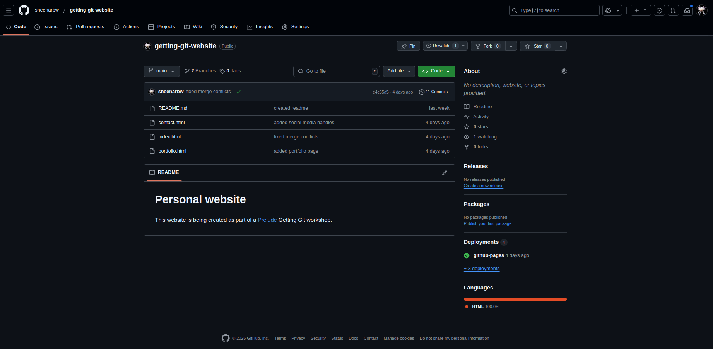
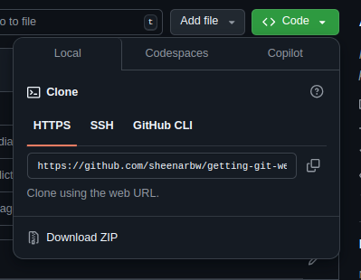

# Cloning and pushing

So far we have spoken a lot about ways to back up your code:

- you can set up a remote for your local repository
- you can push your commits to the remote 

In this section we'll talk about how you can

- download an entire repo 
- download the latest commits on a branch 

## Clone 

In a terminal on your local computer, `cd` into the directory where you store all your repos. In my setup that would mean my `workspace` directory. So I would use the command `cd ~/workspace`. Yours might be somewhere different.

If you are not sure what I'm talking about, revisit [this section](./06-first-repo.md).

Next up, open up a web browser:

Navigate to your Github repo using your web browser. The url will be something like this: `https://github.com/YOUR_GITHUB_USERNAME/YOUR_REPO_NAME`

You'll see a page like this:



You'll notice a green button that says `<> Code ▼`. Click on it.



If you set up your SSH key by doing the optional side quest in [here](./08-github.md) then click on the SSH button, otherwise make sure that HTTPS is selected.

Copy the URL or address in the textbox. You'll need it soon.

Now go back to your terminal and make use of the `git clone` command. You will need to make use of the url you just copied from Github:

```
git clone THE_URL_YOU_COPIED_FROM_GITHUB personal_website_copy
```

You will see some output that looks like this:

```
Cloning into 'personal_website_copy'...
remote: Enumerating objects: 30, done.
remote: Counting objects: 100% (30/30), done.
remote: Compressing objects: 100% (19/19), done.
remote: Total 30 (delta 14), reused 26 (delta 10), pack-reused 0 (from 0)
Receiving objects: 100% (30/30), done.
Resolving deltas: 100% (14/14), done.
```

You will now see that there is a new directory called `personal_website_copy`. Change into this directory using `cd personal_website_copy`.

## Let's explore 

Take a look around for yourself:

- What files and folders can you see in this directory? Try typing `ls`
- What do you think will happen if you type in `git status`? Try it and see 

Now, type in `git branch`. How many branches do you see? This should be a bit surprising. You'll only see one branch! 

Now try `git branch -a`. You should be able to see all your remote branches.

## Let's commit some changes

Let's update our README file:

First, make a new branch and check it out

```
git checkout -b feature/readme
```

This command is a shorthand, it is the same as saying:

```
git branch feature/readme
git checkout feature/readme
```

Now make a change to your README file. Update it so it looks like this:

```
# Personal website 

This website is being created as part of a [Prelude](https://prelude.tech/) Getting Git workshop.

You can see the live version of this website [here](PUT_YOUR_WEBSITE_URL_HERE)
```

Now commit your changes and push them to Github. You can make sure that everything pushed correctly by using the `git branch -a -vv` command or by using the Github website.

## Go back to your original local repo 

At this point you should have two copied of your repo, and these will be in different directories:

- `personal_website`: This is our original local repo. This is where we did all the contact and portfolio feature page work
- `personal_website_copy`: We created this with our `git clone` command and we just added a new branch and commit here. 

Now, `cd` into your original `personal_website` directory: 

```
cd ../personal_website_copy
```

What do you think will happen if you type in the following commands? 

- `git status`
- `git branch`
- `git branch -a`

Try them and see!

When you type in `git branch -a` then you'll see that your original repo does not know about the new branch!

Now type in `git pull`.

The output should look something like this:

```
remote: Enumerating objects: 5, done.
remote: Counting objects: 100% (5/5), done.
remote: Compressing objects: 100% (2/2), done.
remote: Total 3 (delta 1), reused 3 (delta 1), pack-reused 0 (from 0)
Unpacking objects: 100% (3/3), 356 bytes | 356.00 KiB/s, done.
From github.com:sheenarbw/getting-git-website
 * [new branch]      feature/readme -> origin/feature/readme
Already up to date.
```

This tells us that:

- your repo is now aware of the new branch 
- your local main branch is up to date with the remote main branch

Type in `git branch -a` again. Can you see how it changed? You should be able to see a line like this `remotes/origin/feature/readme`.

## Checking out the remote branch 

Execute this command `git checkout feature/readme`. 

You should see output that looks like this: 

```
Branch 'feature/readme' set up to track remote branch 'feature/readme' from 'origin'.
Switched to a new branch 'feature/readme'
```

Can you understand what that means?

What do you think will happen now if you try these commands:

- `git status`
- `git log`
- `git branch -vv`

## Why is this useful?

Usually you wont have 2 separate copies of the same repo on your computer. But it is very normal for 2 or more different people to have their own copies of a repo on their separate computers.

If there are multiple devs working on a project then this kind of thing happens a lot:

- one developer creates a branch and pushes some commits
- another developer pulls the latest code, and checks out the new branch on their own computer

You just learned how to do that.

## Important 

One thing to pay close attention to is this: A local repo does not automatically stay up to date with the remote repo. It does not automatically know about new branches and commits.

If you want your local repo to "know" about all the things that have happened to the remote, then you need to `pull` the changes.


