# Pull requests 

Here is a scenario: Let's say you are working on a team of developers on a project. One of your team-mates was in charge of building a sign-up form feature. 

So they create a new branch: `feature/signup` and they do their work and they `push` it all to Github. When they are finished they'll want to `merge` their work into the `main` branch. 

Now, it's a good idea for someone to review their work before it gets merged into `main`. This means that at least one other team mate should read all of the code that was written and make sure that:

- They understand the code
- The code works
- The code follows all the conventions and agreements of the team
- The code does not introduce any new bugs or brittleness

In other words, someone needs to "review" the code. 

Code review is often a conversation. And sometimes it leads to new commits being made on the code. 

The conversation can become quite complicated sometimes. You might have one thing to say about line 10 of the `signup.html` file and another thing to say about lines 53-72 of the `views.py` file...  Keeping track of the conversation gets pretty tough. 

Now imagine a team of 10 developers all wanting to merge their code into `main`. Imagine how crazy it could get if there were 50 files and 3000 lines of code. Software projects get way bigger than that.

The situation described above is really common. It's common enough that Github and other Git hosts have created tools that help manage these conversations.

## Managing the merge conversation with Github 

If your team was using Github then your team mate would create/open a thing called a **PullRequest (PR)** when they wanted their code to be merged. 

**PullRequests** are things that are implemented by Github, not by Git. If you use something other than Github to manage your remote repo (eg: GitLab or BitBucket) then they will have similar features, but they might call them something different, for example, MergeRequest.

When a person makes a **PR** on a repo then they are effectively saying: I want someone to look at the code in my branch, and I would like to `merge` it into our `main` branch. 

## Viewing and creating PRs

On Github, navigate to your repo, then click on the "Pull Requests" tab to see a list of all the "open" PRs.

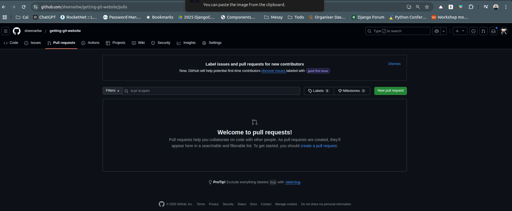

When you visit this page for the first time there will not be any PRs so there wont be a lot to see.

Now, click on the "New Pull Request" button.

Now click on the dropdown menu that says `compare: main`. It will look similar to this:

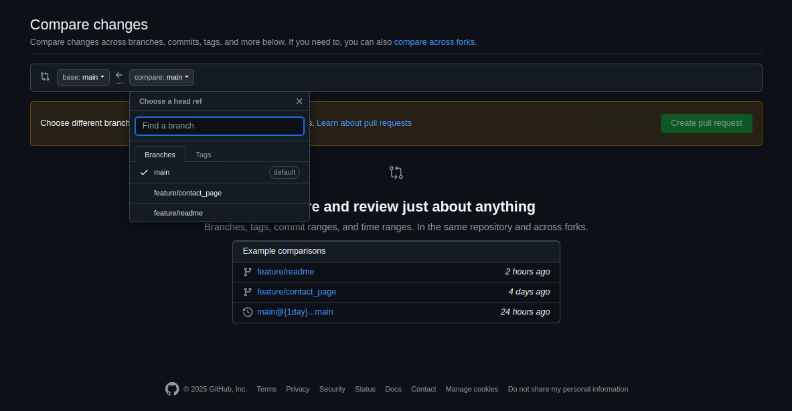

Here you can select the branch you would like to merge into `main`.

Select `feature/readme`.

You will now be able to see a list of all your commits and all your file changes.

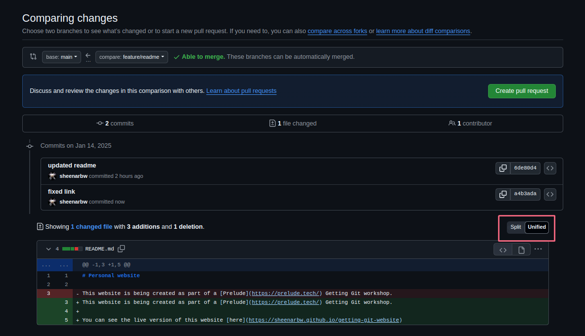

Notice that there is a way to toggle between "Split" and "Unified". These display your code changes in different ways. Some people prefer a split view, and some prefer a unified view, it's up to you what you want to see.

**Note on good practice:** Sometimes PRs can contain a LOT of changes. Before you click the "Create pull request" button that you can see on the top right, it is important to make sure you want to merge all the code in the branch.  Always look over your own code before asking someone else to! Review your own work before asking someone else to review it!

Once you are happy that the code looks how you want to, then click on the `Create pull request` button.

Now you will be presented with a form:

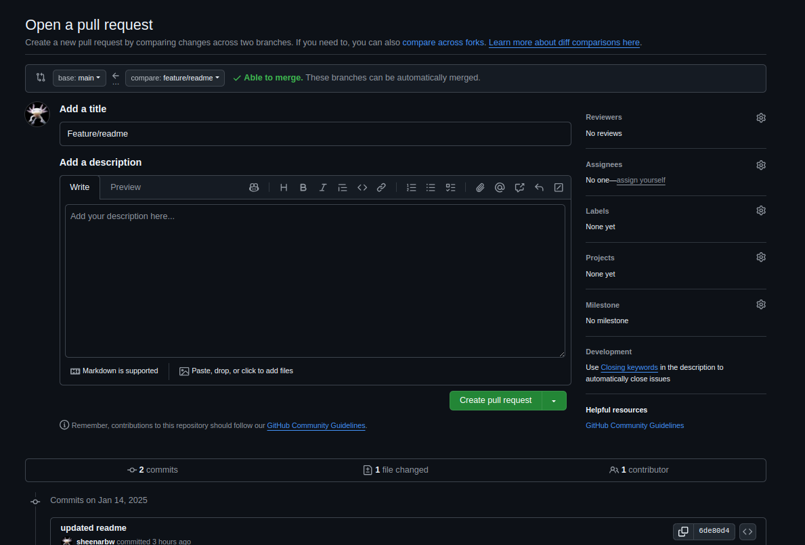

**Remember that PRs exist to make communication between developers easier!** 

It's useful to take care in communicating. If you spend an extra minute filling in this form clearly then it will save time for whoever is reviewing the code.

Let's change the title to something meaningful. For example "Updated README so it links to live website".

In this case, the PR is pretty simple so there is no need to do anything in the description field. It's often useful to fully describe the functionality you are implementing. Different teams and projects often have different conventions for how to fill in the description field.

Once you are happy then click the "Create pull request" button. If you are sad, you are still allowed to click the button.

You will now get to a page that looks like this:

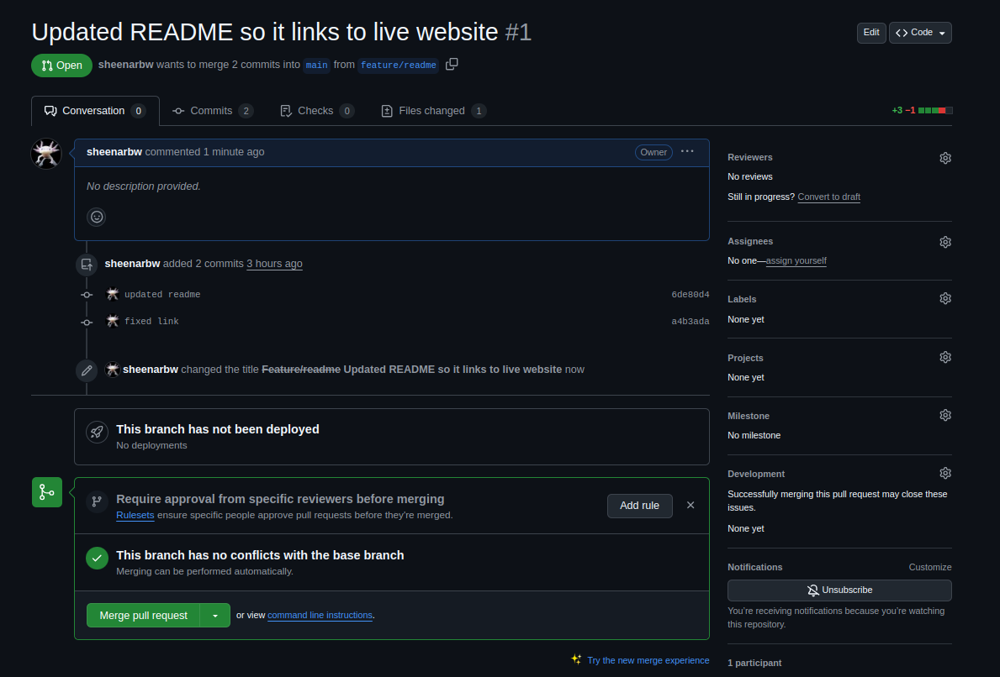

Take a bit of time to explore. You should be able to see any commits you want to merge, and you'll be able to view your code changes.

## Reviewing a PR 

Let's pretend a team mate made the PR and they have asked you to review it. You would be able to find a link to the PR if you navigate to your repo's "Pull Requests" tab:

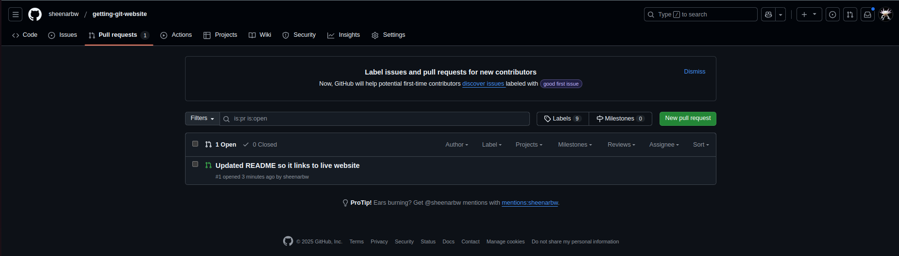

You would then be able to look at the "Files Changes" for the PR and make sure you are happy with what you see:

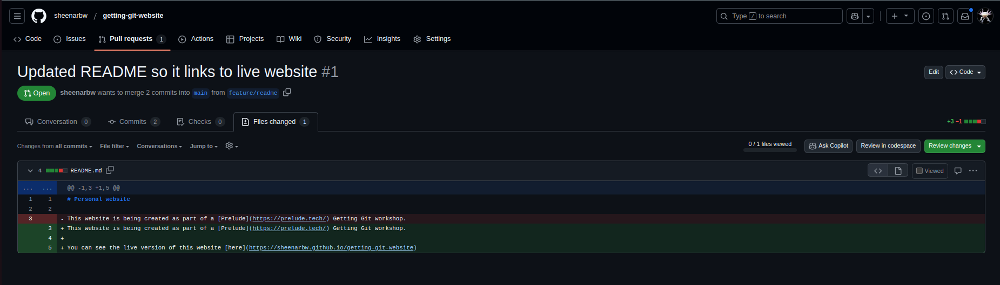

You would be able to hover over any line in the code changes and a little blue + button will appear. If you click on the button then you will be able to add a comment:

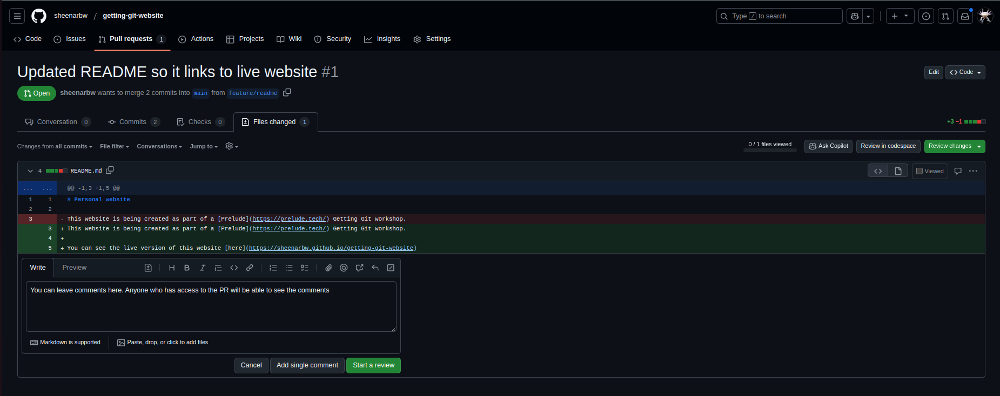

If you submit the form by clicking the "Add single comment" then the comment will immediately be visible to anyone who has access to the PR.

Usually you would want to leave comments as a part of a review:

- Fill in a comment, say whatever you feel like
- Click the green "Start a review" button
- Click on "Finish your review" (top right) 

You'll see a new form:

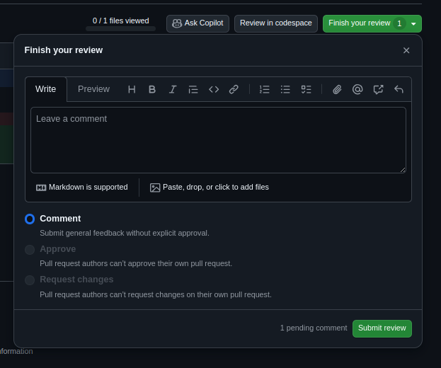

Take note that this form says "1 pending comment" at the bottom. This means that the comment you made before is not yet visible to anyone. It will only be visible once you have submitted the review.

Fill in another comment, and click on "Submit Review".

## Viewing the comments

Now go navigate to the "Conversation" tab for your PR. Do you see your comments there?

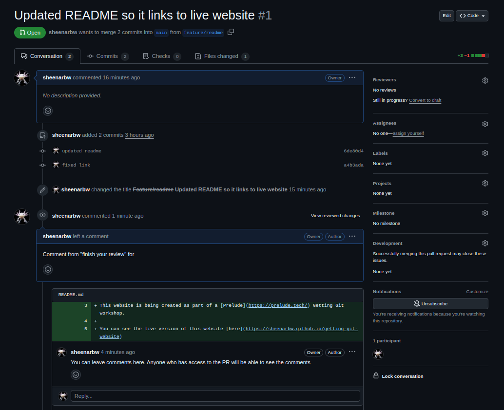

Note that you can add replies to the different comments. 

## Play!

Play with this for a bit. 

- Make sure you know the difference between the "Add single comment" and "Start a Review" buttons. 
- Make sure you know how to check if there are "pending comments". 
- Make sure you can view the comments
- Make sure you know when comments will show up on the "conversation" tab

## Merge!

Now, on the conversation tab, scroll down and click on "Merge pull request" and then "Confirm merge".

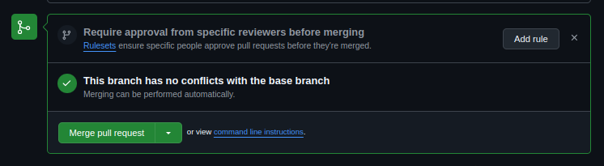

Now, if you go back to your repo's "Pull Requests" tab, the list of PRs will be empty again.

You can get your merged PR to ve visible by editing the search term: Instead of saying `is:pr is:open`, edit it to say `is:pr` and press Enter:

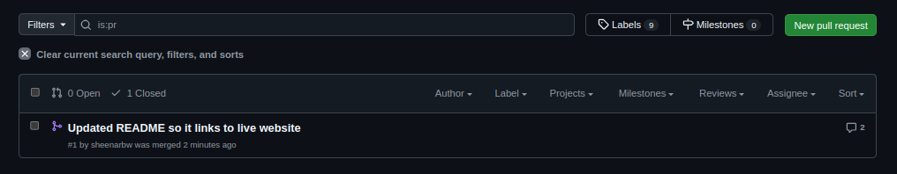 

Feel free to poke around and explore.

## Back to your computer

Now, on your computer, `cd` to your original repo, `checkout` main and do a `git pull`. 

You'll see that your local `README.md` file is now up to date, it has the latest changes.

What do you think these commands will do? Think about it before executing them.

- `git status`
- `git log`
- `git branch -a --v`

Make sure you understand what you are seeing!

## More on PRs

To learn more about PRs, check out the [Github documentation](https://docs.github.com/en/pull-requests/collaborating-with-pull-requests/proposing-changes-to-your-work-with-pull-requests/about-pull-requests). It is very thorough and the nice folks at Github work hard to keep it up to date!

## When you are done here

When you are done with this section, post a message to the Discord channel. Give us a link to your repo.

## Challenge: Make a PR on someone else's personal_website repo 

This will take a bit of coordination. You'll need to speak to the other workshop participants to get this right :) 

If you are the first person here and none of the other workshop participants are ready for this then feel free to move onto the next section. Please come back to this later on though, there are some important lessons in here!

Here is the challenge:

1. Clone someone else's repo 
2. Make a branch and make some changes. Don't worry too much about doing something fancy. You can make a change to the `README.md` file, add a new page, or make a small change to an existing page.
3. Push your branch 
4. Open a PR 
5. Get the PR merged 

You will hit some surprising challenges. See if you can solve them!

If someone is trying to make a PR on your repo, then try to set them up for success! Make sure you communicate clearly! 

Here are a few things to explore while you do this:

1. Can you figure out what it means to "Accept" a PR? How about "Request Changes"? And "Close"?
2. Can a developer "Accept" a PR that they created?
3. Can a developer "Accept",or comment on a PR that was created on a repo they don't own?
4. What happens to a PR if more commits are pushed after the PR was created? 

You should have the `git` command-line skills to try all these things out! 

